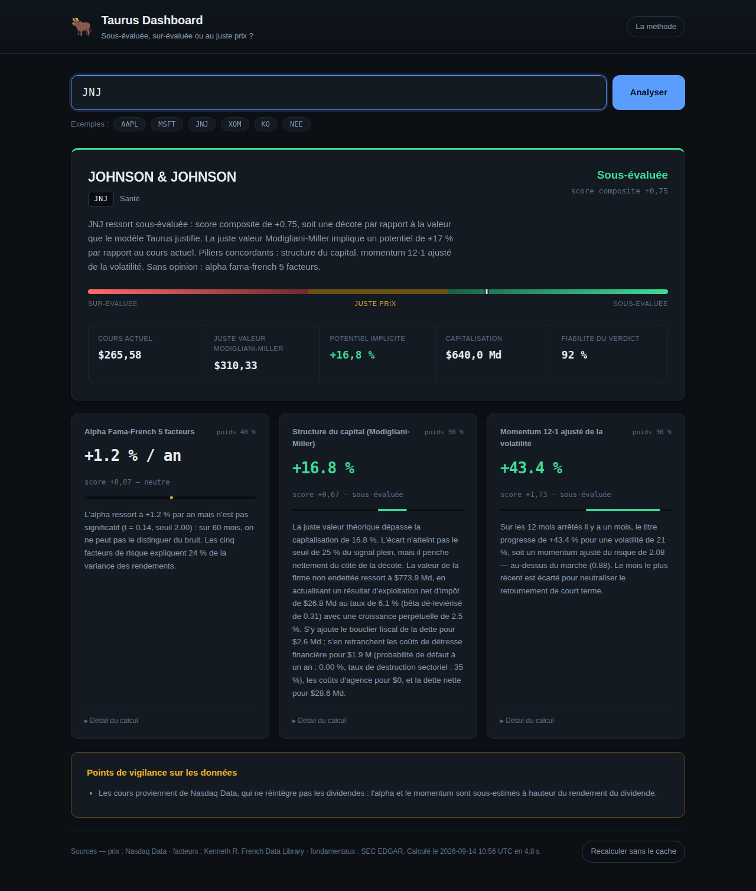

# Taurus Dashboard

Saisissez le ticker d'une société : le moteur rejoue sur ce seul titre les
trois piliers de la stratégie **Taurus** et rend un verdict — **sous-évaluée**,
**sur-évaluée** ou **au juste prix** — accompagné d'une juste valeur par
action et du détail de chaque calcul.



---

## Démarrage

```bash
pip install -r requirements.txt
cp .env.example .env        # facultatif : renseigne une clé d'API et le contact SEC
./run.sh                    # → http://127.0.0.1:8000
```

Aucune clé d'API n'est requise. Le dashboard fonctionne sur des sources
gratuites (SEC EDGAR, bibliothèque de Kenneth French, Yahoo Finance). Une clé
Financial Modeling Prep dans `.env` améliore la couverture et la fiabilité.

```bash
python3 -m pytest             # 129 tests, sans accès réseau
```

---

## Ce que fait le moteur

L'algorithme de production (dépôt `Trading-strategy-Taurus`) est un long/short
**cross-sectionnel** : il classe environ 500 titres les uns par rapport aux
autres et retient les 25 meilleurs et les 25 pires. Ce classement n'a aucun
sens sur un titre isolé.

Le dashboard conserve les trois piliers analytiques et les rapporte aux
**seuils absolus** que l'algorithme utilise déjà :

| Pilier | Mesure | Seuil de déclenchement | Poids |
|---|---|---|---|
| Alpha Fama-French 5 facteurs | statistique *t* de l'intercept | valeur critique de Student (≈ 2,00) | 40 % |
| Structure du capital (Modigliani-Miller) | divergence juste valeur / capitalisation | ± 25 % | 30 % |
| Momentum 12-1 ajusté de la volatilité | écart de momentum-Sharpe au marché | 0,50 | 30 % |

Chaque pilier produit un score `signal / seuil`, **borné à ± 2** : un score de
+1 signifie « ce pilier déclenche exactement son signal d'achat ». Le bornage
empêche une valeur aberrante — un *t* de 40 sur un titre au cours figé —
d'écraser les deux autres.

Le score composite est la moyenne pondérée des piliers **disponibles** : si un
pilier manque, son poids est redistribué plutôt que compté comme un zéro. Un
signal absent n'est pas un signal neutre.

| Score composite | Verdict |
|---|---|
| ≥ +1,00 | Fortement sous-évaluée |
| ≥ +0,50 | Sous-évaluée |
| entre −0,50 et +0,50 | Au juste prix |
| ≤ −0,50 | Sur-évaluée |
| ≤ −1,00 | Fortement sur-évaluée |

Le verdict exige donc la **concordance d'au moins deux piliers** : un pilier
seul, même saturé, ne pèse que 0,60 et ne franchit pas le seuil.

En régime de krach de momentum — volatilité du dernier mois supérieure au
double de la moyenne des douze précédents — la moitié du poids du momentum
bascule sur l'alpha, comme dans l'algorithme de production.

---

## Une correction apportée au modèle Modigliani-Miller

Le module `taurus/capital_structure.py` de l'algorithme de production calcule

```
V_U = capitalisation + dette nette − VA(bouclier fiscal)
V_L = V_U + VA(bouclier fiscal) − VA(détresse) − coûts d'agence
```

Le bouclier fiscal s'annule entre les deux lignes. Il reste :

```
capitaux propres théoriques = capitalisation − détresse − agence
divergence = −(détresse + agence) / capitalisation  ≤ 0  toujours
```

La juste valeur est donc **définie à partir du cours qu'elle est censée
juger**, et le signal ne peut structurellement jamais désigner une société
comme sous-évaluée. Vérification numérique sur l'algorithme lui-même :

| Cas de figure | Divergence |
|---|---|
| Technologie peu endettée | −0,001 % |
| Service public très endetté | −0,011 % |
| Valeur délaissée | −2,79 % |
| Société en détresse | −53,56 % |

Le dashboard estime la valeur non endettée **à partir des fondamentaux**,
selon la valeur actuelle ajustée (APV), formulation canonique de
Modigliani-Miller :

```
NOPAT = EBIT × (1 − τ)
β_U   = β_L / (1 + (1 − τ)·D/E)          dé-leviérisation de Hamada
r_U   = rf + β_U × prime de risque       MEDAF sans effet de levier
V_U   = NOPAT × (1 + g) / (r_U − g)      perpétuité croissante
```

Les trois frottements — bouclier fiscal, coûts de détresse de Merton, coûts
d'agence — sont calculés exactement comme dans l'algorithme de production.

Le détail de l'analyse, ses conséquences sur la stratégie de production et les
limites de la correction figurent dans [`docs/METHODOLOGIE.md`](docs/METHODOLOGIE.md).

---

## Sources de données

Chaque famille de données passe par une chaîne de repli : aucune source n'est
indispensable, et l'interface indique toujours celle qui a servi.

| Donnée | Ordre de priorité |
|---|---|
| Cours mensuels | Financial Modeling Prep (si clé) → Yahoo Finance → marketdata.app → Nasdaq Data |
| Facteurs FF5 | Kenneth R. French Data Library |
| Fondamentaux | SEC EDGAR (XBRL) → Financial Modeling Prep (si clé) |
| Secteur | code SIC de SEC EDGAR, traduit en nomenclature GICS |

Nasdaq Data ne réintègre pas les dividendes : lorsque cette source est
utilisée, l'alpha et le momentum sont sous-estimés à hauteur du rendement du
dividende, et le dashboard le signale.

Les réponses sont mises en cache sur disque (`.cache/`, 12 h par défaut).

---

## API

| Route | Description |
|---|---|
| `GET /api/analyze/{ticker}` | Analyse complète. `?refresh=true` ignore le cache. |
| `GET /api/config` | Paramètres du moteur. |
| `GET /api/health` | État du service. |
| `POST /api/cache/clear` | Vide le cache disque. |

```bash
curl -s http://127.0.0.1:8000/api/analyze/JNJ | jq '{verdict_label, composite_score, fair_value, upside_pct}'
```

```json
{
  "verdict_label": "Sous-évaluée",
  "composite_score": 0.548,
  "fair_value": 310.33,
  "upside_pct": 16.85
}
```

---

## Organisation du dépôt

```
taurus_core/              moteur de valorisation
├── config.py             hyper-paramètres (repris de TaurusConfig)
├── alpha.py              pilier 1 — régression Fama-French, erreur-type HC1
├── capital_structure.py  pilier 2 — juste valeur Modigliani-Miller (APV)
├── momentum.py           pilier 3 — momentum 12-1 ajusté de la volatilité
├── valuation.py          orchestration, score composite, verdict
├── cache.py              cache disque avec durée de vie
└── providers/            accès aux données, avec repli entre fournisseurs
backend/                  API FastAPI et sérialisation JSON
frontend/                 interface web (HTML/CSS/JS, sans compilation)
tests/                    129 tests, sans accès réseau
docs/METHODOLOGIE.md      justification des choix et limites du modèle
```

---

## Limites

- La valorisation par perpétuité est **très sensible** au taux d'actualisation
  et à la croissance retenue. Le pilier Modigliani-Miller affiche une grille de
  sensibilité : elle est à lire avant toute décision.
- Un modèle sans prime de croissance sous-valorise structurellement les
  sociétés en forte expansion. Un verdict « sur-évaluée » sur une valeur de
  croissance dit que le marché anticipe mieux que la perpétuité, pas
  nécessairement qu'il a tort.
- La couverture est **centrée sur les États-Unis** : SEC EDGAR ne référence que
  les sociétés déposant auprès de la SEC.
- Les facteurs de Kenneth French sont publiés avec un à deux mois de décalage.

Cet outil est un support d'analyse quantitative. Ce n'est pas un conseil en
investissement.
